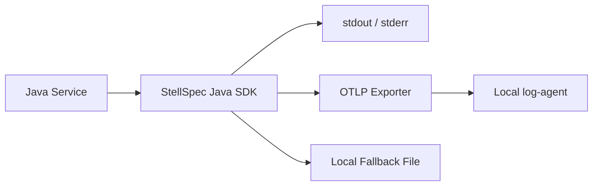

# StellSpec Java SDK

`stellspec-java-sdk` 是 StellSpec 星谱面向 Java 生态的日志与可观测性 SDK。它基于 OpenTelemetry Logs，为自研框架和 Java 服务提供统一日志采集、资源语义映射、OTLP 上报、失败兜底和结构化错误属性能力。

## 项目概述

该 SDK 的定位不是替代 Logback、Log4j2 或业务日志框架，而是在基础设施层提供一套统一的日志接入规范。它对上暴露不依赖 Spring 的通用 API，对下对接 OpenTelemetry 与本机 log-agent。

## 当前状态

| 项目 | 说明 |
| --- | --- |
| 稳定性 | 开发中 |
| 适用对象 | Java 服务、自研 Java 框架、基础设施组件 |
| 核心标准 | OpenTelemetry Logs |
| 默认出口 | 开发环境 stdout/stderr，非开发环境 OTLP log-agent |
| 维护方 | StellHub |

## 解决什么问题

- 统一 Java 服务日志接入方式。
- 标准化 `service.*`、`k8s.*`、`host.*` 等资源语义。
- 在非开发环境默认通过 OTLP 发送到本机 log-agent。
- 支持 exporter 重试、最终失败本地落盘和超长正文截断。
- 提供结构化错误属性，例如 `error.type` 与 `stellar.error.*`。
- 为自研框架提供通用 `Appender` / `Logger` API。

## 不解决什么问题

- 不替代业务日志框架的全部能力。
- 不负责日志平台后端的索引、查询和存储。
- 不提供用户鉴权、审计和权限管理。
- 不强依赖 Spring，也不绑定单一业务框架。

## 核心能力

| 能力 | 说明 | 典型场景 |
| --- | --- | --- |
| 统一配置 | 统一读取运行环境和日志出口配置 | 多服务一致接入 |
| 资源语义 | 映射 service、k8s、host 等属性 | 日志检索和聚合 |
| OTLP 上报 | 将日志发送到本机 log-agent | 生产日志采集 |
| 控制台输出 | 开发环境输出 stdout/stderr | 本地调试 |
| 失败兜底 | 重试失败后本地落盘 | 防止日志静默丢失 |
| 错误结构化 | 提供错误类型和堆栈属性 | 故障排查 |

## 架构说明



SDK 运行在业务进程内。开发环境优先输出到控制台；非开发环境默认通过 OTLP 将日志发送到本机 log-agent；当 exporter 多次失败后，SDK 可以将日志落入本地兜底文件。

## 快速开始

### 1. 引入依赖

```xml
<dependency>
    <groupId>io.github.stellhub</groupId>
    <artifactId>stellspec-java-sdk</artifactId>
    <version>${stellspec.version}</version>
</dependency>
```

### 2. 初始化日志组件

```java
StellSpecLogger logger = StellSpecLoggerFactory.create("order-service");
logger.info("order created");
```

### 3. 记录结构化错误

```java
try {
    processOrder();
} catch (Exception ex) {
    logger.error("process order failed", ex);
}
```

## 配置说明

| 配置项 | 是否必填 | 默认值 | 说明 |
| --- | --- | --- | --- |
| service.name | 是 | 无 | 服务名 |
| service.namespace | 否 | default | 服务命名空间 |
| stellspec.env | 否 | dev | 运行环境 |
| stellspec.otlp.endpoint | 否 | localhost log-agent | OTLP 日志上报地址 |
| stellspec.exporter.retry | 否 | true | 是否开启 exporter 重试 |
| stellspec.fallback.enabled | 否 | true | 是否开启失败本地落盘 |

## 本地开发

```bash
mvn clean test
mvn clean package -DskipTests
```

## 测试

涉及 exporter、重试、落盘、资源属性映射和错误属性的改动必须补充测试。提交前建议执行：

```bash
mvn clean verify
```

## 版本与升级

- `MAJOR`：不兼容 API、属性语义或默认出口变更。
- `MINOR`：向后兼容的新能力。
- `PATCH`：向后兼容的问题修复。

升级时重点关注资源属性名、默认 endpoint、失败兜底策略和日志截断行为。

## 可观测性

| 类型 | 名称 | 说明 |
| --- | --- | --- |
| Metric | stellspec_export_success_total | 日志导出成功次数 |
| Metric | stellspec_export_failure_total | 日志导出失败次数 |
| Metric | stellspec_fallback_write_total | 本地兜底写入次数 |
| Log | EXPORTER_RETRY | exporter 重试 |
| Log | FALLBACK_WRITE_FAILED | 本地兜底写入失败 |

## 故障排查

### 生产环境没有日志

1. 检查 log-agent 是否在本机运行。
2. 检查 OTLP endpoint 是否正确。
3. 检查 exporter 是否出现重试或失败日志。
4. 检查是否写入本地 fallback 文件。

### 日志资源属性不正确

1. 检查 `service.name` 是否配置。
2. 检查运行环境变量是否符合规范。
3. 检查 k8s、host 相关属性是否由运行环境注入。

## 安全说明

- 不要在日志中打印 token、密码、密钥和敏感个人信息。
- 本地 fallback 文件需要限制访问权限。
- 生产环境日志采集链路应配合平台侧审计和保留策略。

## 目录结构

```text
.
├── src/            # SDK source code
├── examples/       # 使用示例
├── docs/           # 扩展文档
├── pom.xml         # Maven 构建文件
└── README.md       # 项目说明
```

## 贡献规范

- 公共 API 变更必须说明兼容性影响。
- 默认行为变更必须同步更新 README 和 CHANGELOG。
- 不允许无测试修改 exporter、fallback 和资源属性映射逻辑。

## 支持

由 StellHub 维护。建议通过 GitHub Issues 记录问题、需求和设计讨论。

## 许可证

以仓库内 `LICENSE` 文件为准。